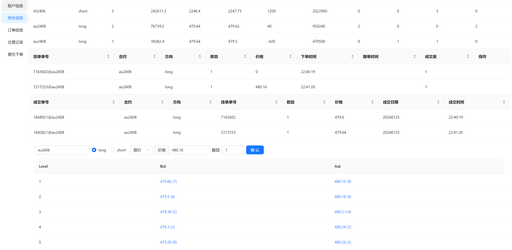

# CTP接口Python Web服务

基于[ctpwrapper](https://github.com/nooperpudd/ctpwrapper)和[ctp_client](https://github.com/zhou-yuxin/ctp_client)的CTP轻量级Python Web服务封装，可查询期货、期权行情以及进行下单交易。

- [x] HTTP请求期货期权合约代码
- [x] HTTP获取持仓、资金、今日订单、今日成交
- [x] HTTP下单(限价、市价单的开仓与平仓)
- [x] 每日定时自动启动(白天8:40，夜盘20:40)
- [x] HTTP订阅行情
- [x] 展示页面

## 安装
- 以Ubuntu为例:
```bash
cd ctp-server
apt install python3.9 python3.9-dev python3.9-venv
python3.9 -m venv venv
pip install cython==0.29.33  wheel==0.40.0
pip install -r requirements.txt
cd app
python ctp_service.py
```

## 使用

### 配置config.json

配置CTP实盘账号或Simnow账号
```json
{
    "investor_id": "******",
    "broker_id": "9999",
    "password": "******",
    "md_server": "tcp://180.168.146.187:10131",
    "trader_server": "tcp://180.168.146.187:10130",
    "app_id": "simnow_client_test",
    "auth_code": "0000000000000000"
  }
```

### 启动服务

```shell
cd server
export PYTHONPATH=.
python app/ctp_service.py
```

### 启动展示页面

```shell
npm install && npm start  
```

展示效果



## HTTP接口

### 行情功能

- 获取期货合约所有代码
  
```python
data = requests.get('http://127.0.0.1:7000/get_instruments_future?exchange=INE').json()
print(data[0])
{'name': '原油2309', 'exchange': 'INE', 'multiple': 1000, 'price_tick': 0.1, 'expire_date': '2023-08-31', 'long_margin_ratio': 0.17, 'short_margin_ratio': 0.17, 'option_type': None, 'strike_price': 0.0, 'is_trading': True, 'symbol': 'sc2309'}
```

- 获取期权合约所有代码
  
```python
data = requests.get('http://127.0.0.1:7000/get_instruments_option?func_name=sc2302').json()
print(data[0])
{'name': 'sc2302C510', 'exchange': 'INE', 'multiple': 1000, 'price_tick': 0.05, 'expire_date': '2022-12-28', 'long_margin_ratio': None, 'short_margin_ratio': None, 'option_type': 'call', 'strike_price': 510.0, 'is_trading': True, 'symbol': 'sc2302C510'}
```

- 订阅、取消订阅行情
  
```python
data = requests.get('http://127.0.0.1:7000/subscribe?codes=MA301').json()
print(data)
{'trade_time': '2022-11-24 03:07:28', 'update_sec': 0, 'code': 'MA301', 'price': 2583.0, 'open': 2530.0, 'close': 2553.0, 'highest': 2588.0, 'lowest': 2523.0, 'upper_limit': 2732.0, 'lower_limit': 2374.0, 'settlement': 2546.0, 'volume': 1690398, 'turnover': 4325728482.0, 'open_interest': 1013956, 'pre_close': 2542.0, 'pre_settlement': 2553.0, 'pre_open_interest': 1068566, 'ask1': (2584.0, 659), 'bid1': (2583.0, 497), 'ask2': (None, 0), 'bid2': (None, 0), 'ask3': (None, 0), 'bid3': (None, 0), 'ask4': (None, 0), 'bid4': (None, 0), 'ask5': (None, 0), 'bid5': (None, 0)}

data = requests.get('http://127.0.0.1:7000/unsubscribe?codes=MA301').json()
```


### 交易功能

- 获取资金
```python
data = requests.get('http://127.0.0.1:7000/get_account').json()
{'balance': 20011519.72, 'margin': 0.0, 'available': 20011519.72}
```

- 下限价单
```python
data = requests.get('http://127.0.0.1:7000/order_limit?code=MA301&direction=long&volume=6&price=2600').json()
data = requests.get('http://127.0.0.1:7000/order_limit?code=sc2302&direction=long&volume=1&price=600').json()
```

- 获取持仓
```python
data = requests.get('http://127.0.0.1:7000/get_postion').json()

[
    {'code': 'MA301',
    'direction': 'long',
    'volume': 6,
    'margin': 24883.2,
    'cost': 155520.0},
    {'code': 'sc2302',
    'direction': 'long',
    'volume': 1,
    'margin': 97580.00000000001,
    'cost': 574000.0}
]
```

- 查看今日订单
```python
data = requests.get('http://127.0.0.1:7000/get_orders').json()
  
[
    {'code': 'MA301',
    'direction': 'long',
    'volume': 6,
    'margin': 24883.2,
    'cost': 155520.0},
    {'code': 'sc2302',
    'direction': 'long',
    'volume': 1,
    'margin': 97580.00000000001,
    'cost': 574000.0}
]
```

  - 撤单
  ```python
  data = requests.get('http://127.0.0.1:7000/order_limit?code=MA301&direction=long&volume=6&price=2500').json()
  print(data)
  # '       36554@MA301'
  data = requests.get('http://127.0.0.1:7000/order_delete?order_id=       36554@MA301').json()
  ```


